# Báo cáo cá nhân — K4-L3B Day 13 Monitoring & LLMOps

> Mỗi học viên hoàn thiện một file duy nhất này. Khi dẫn evidence, dùng đường dẫn tương đối, ví dụ `evidence/07-trace-waterfall.png`.

## 1. Thông tin học viên

- **Họ và tên:** Nguyễn Văn Thắng
- **MSSV:** 2A202602835
- **Lớp:** K4-L3B
- **Repository URL:** https://github.com/nguyenthang23092005/K4-L3B-Day13-NguyenVanThang-2A202602835-Monitoring-LLMOps
- **Commit SHA cuối:** Chờ tạo commit nộp sau cùng; cập nhật lại bằng `git rev-parse HEAD` ngay trước khi nộp.
- **Challenge ID:** `day13-k4-l3b-monitoring-llmops-v1` (file đề chỉ lưu local tại `config/challenge.json`, bị Git ignore).
- **Tên project Langfuse cá nhân:** `day13-k4-l3b-2A202602835`

## 2. Evidence index

Điền đúng đường dẫn tới evidence thực tế. Có thể đổi tên hoặc dùng nhiều ảnh nếu cần.

| Evidence | Đường dẫn |
|---|---|
| Pytest cuối | 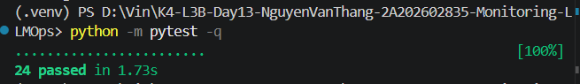 |
| Log validator | [02-log-validator.txt](evidence/02-log-validator.txt) |
| Dashboard validator | [03-dashboard-validator.txt](evidence/03-dashboard-validator.txt) |
| Structured log | 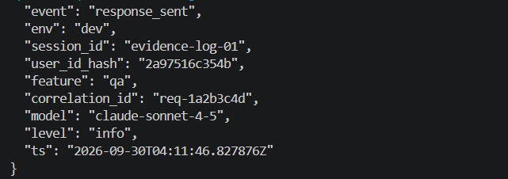 |
| PII redaction | 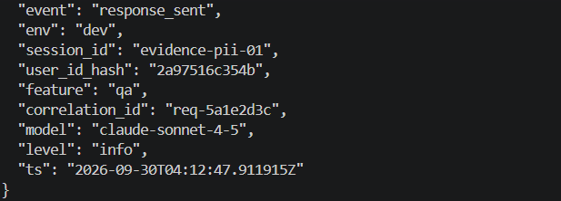 |
| Trace list | 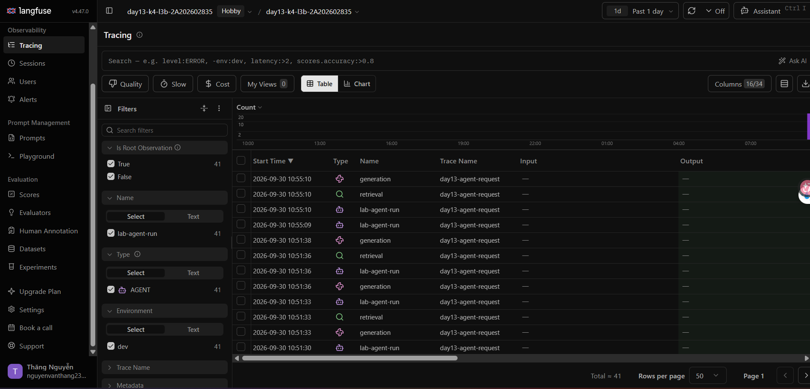 |
| Trace waterfall | 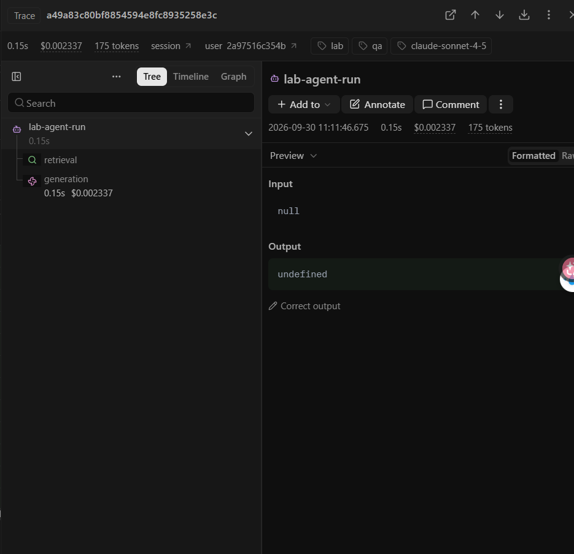 |
| Trace metadata | 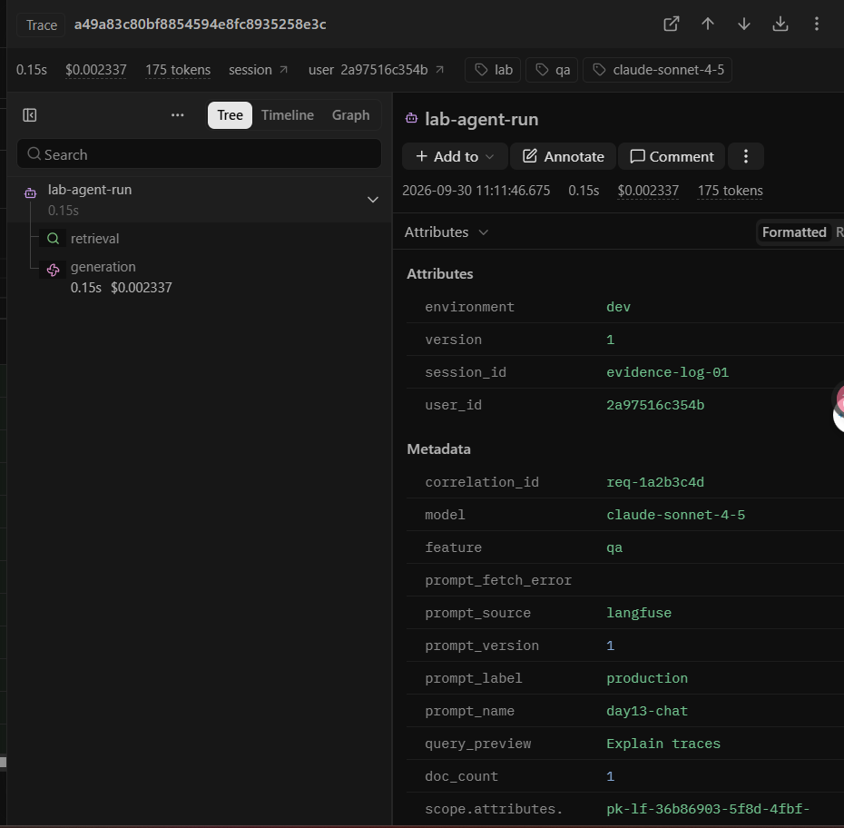, 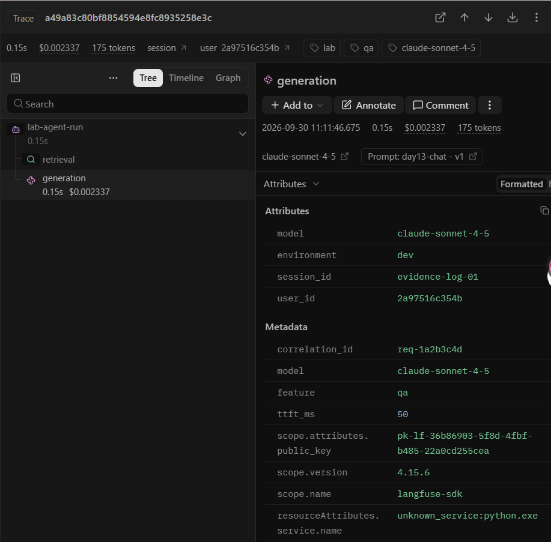 |
| Prompt versions | 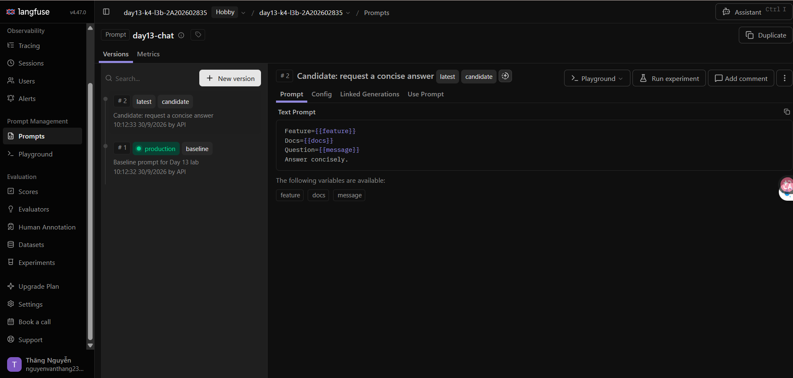 |
| Prompt rollback | 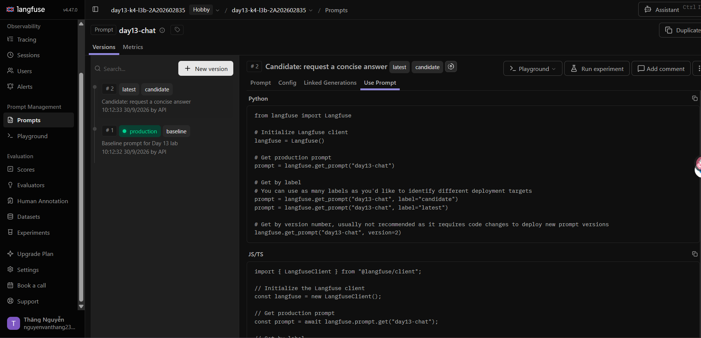, 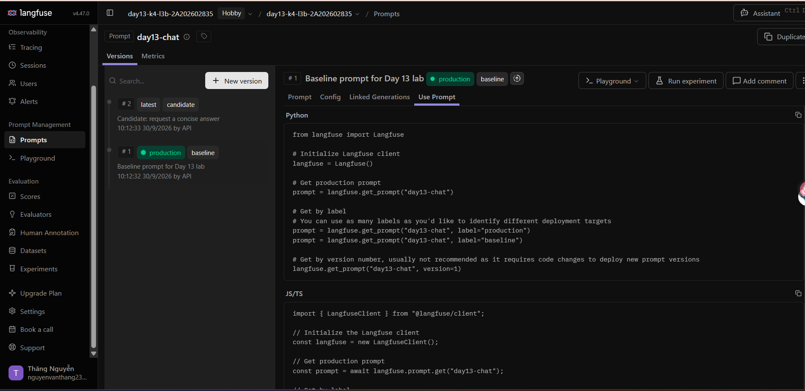 |
| Dashboard runtime | 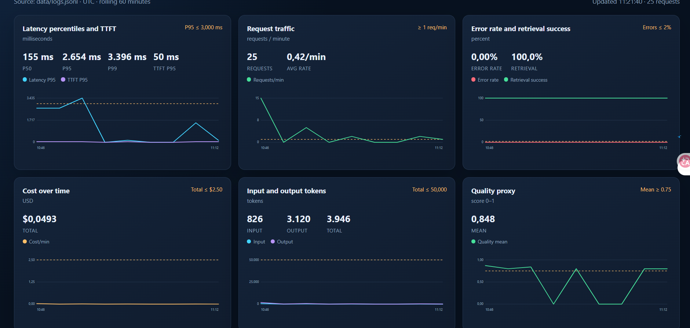 |
| Incident metric | 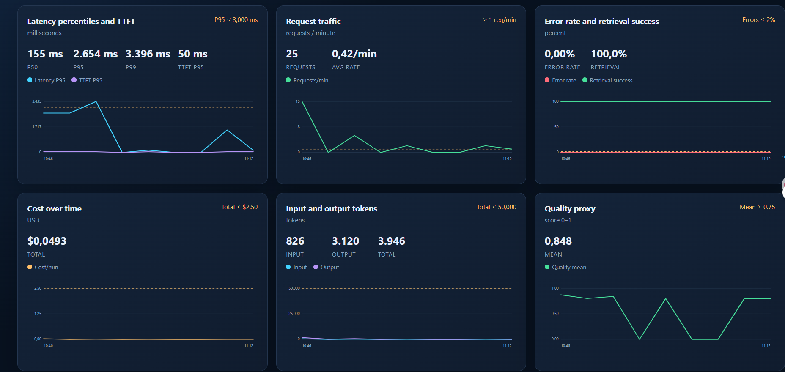 |
| Incident log | 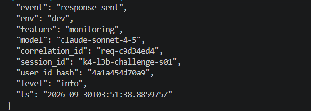 |
| Incident trace | 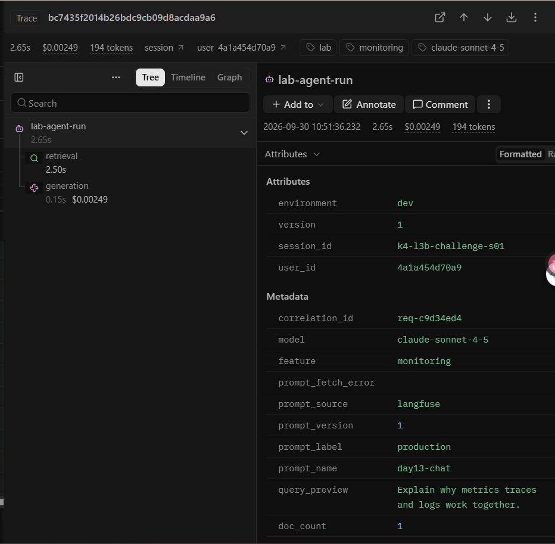 |

## 3. Kết quả kỹ thuật

| Nội dung | Baseline | Kết quả cuối | Nhận xét |
|---|---|---|---|
| `validate_logs.py` | 30/100 | 100/100 | Đủ schema, correlation ID, enrichment và PII scrubbing |
| `validate_dashboard.py` | | 6/6 panel | Contract có đủ time range, refresh, query, unit và threshold |
| `pytest` | | 24 passed | Chạy bằng Python trong `.venv` |
| Số traces hợp lệ | | 12 | Xác minh trong cửa sổ gần nhất; mỗi trace có `lab-agent-run`, `retrieval`, `generation`, prompt link, model, usage và cost |
| Số PII leak | | 0 | Validator kiểm tra toàn bộ `data/logs.jsonl` |
| Latency P95 / TTFT P95 | | 156 ms / 52 ms | Baseline CP3 10 request sau khi prompt cache sẵn sàng |
| Retrieval success rate | | 100% | Tính trên mọi event có field `tool_success` |

## 4. Logging và PII

- **Cách tạo/nhận và truyền correlation ID:** middleware xóa context cũ, nhận `x-request-id` hoặc sinh `req-<8 hex>`, bind vào contextvars, truyền vào agent/trace và trả lại qua response header.
- **Các metadata được ghi vào structured log:** `correlation_id`, `user_id_hash`, `session_id`, `feature`, `model`, `env`, cùng latency, TTFT, token, cost, quality và trạng thái tool khi có.
- **Cách bảo đảm PII được scrub trước khi ghi:** `scrub_event` chạy trước `JsonlFileProcessor` và JSON renderer; `user_id` chỉ xuất hiện dưới dạng SHA-256 rút gọn, còn preview được scrub email, điện thoại VN, CCCD và thẻ.
- **Cách kiểm chứng kết quả:** request structured-log dùng `correlation_id=req-1a2b3c4d`; request PII dùng `correlation_id=req-5a1e2d3c`. Cả hai trả response header trùng ID; log PII chỉ còn các marker `REDACTED_*`; sau đó chạy `python scripts/validate_logs.py` và pytest.

## 5. Tracing và prompt versioning

- **Cách xác nhận traces do chính tôi tạo trong project cá nhân:** lọc trace name `day13-agent-request`, environment `dev` và khoảng thời gian chạy load test; đối chiếu `correlation_id` với log local.
- **Cấu trúc root/retrieval/generation observations:** trace `day13-agent-request` có root `lab-agent-run` (agent), child `retrieval` (retriever) và child `generation` (generation). Generation có model, usage, cost và không capture raw input/output.
- **Cách nối trace với log:** metadata của `lab-agent-run` chứa cùng `correlation_id` dạng `req-<8 hex>` với cặp log `request_received`/`response_sent`.
- **Prompt name:** `day13-chat` (text prompt với ba biến `{{feature}}`, `{{docs}}`, `{{message}}`).
- **Version/label baseline:** version 1, labels `baseline` và `production` sau rollback.
- **Version/label candidate:** version 2, labels `candidate` và `latest`.
- **Trace ID của mỗi version:** baseline v1 `55252da09120314e84404a0c0a9ee173`; candidate v2 `477f78269d4b2c630ba69325eb11ac5f`.
- **Cách promote và rollback `production`:** đã dời `production` sang v2 và xác nhận trace `3c3bf00ed2d04690d3f84cc8751e6981` dùng version 2; sau đó dời lại về v1 và xác nhận trace `276c9f07f80e4646e46e75758eee066b` dùng version 1.

## 6. Dashboard, SLO và alerts

- **Dashboard và sáu panel:** dashboard local đọc `data/logs.jsonl`, mặc định 60 phút và refresh 30 giây; gồm Latency/TTFT, Traffic, Errors/Retrieval success, Cost, Tokens và Quality, mỗi panel có đơn vị và threshold theo `config/dashboard.yaml`.
- **SLO và lý do chọn:** 99.5% request trong cửa sổ 28 ngày phải có `response_sent` và latency ≤ 3000 ms. Baseline CP3 P95 là 156 ms nên ngưỡng này có khoảng đệm cho biến động bình thường nhưng vẫn phát hiện rõ incident P95 3630 ms.
- **Cách tính error budget:** error budget là `100% - 99.5% = 0.5%`; với 10,000 request, tối đa `10,000 × 0.005 = 50` request được phép lỗi hoặc chậm hơn 3000 ms.
- **Ba alert và runbook tương ứng:** `HighLatencyP95` → `docs/alerts.md#alert-1`; `HighRequestErrorRate` → `#alert-2`; `LowRetrievalSuccessRate` → `#alert-3`. Mỗi runbook đi theo Metrics → Logs/correlation ID → Langfuse trace rồi mới mitigation.

> Ví dụ cách viết error budget: "SLO 99.5% trong 28 ngày nghĩa là error budget 0.5%. Nếu workload có 10,000 request thì tối đa 50 request được phép lỗi hoặc chậm hơn ngưỡng SLO."

## 7. Điều tra challenge

- **Challenge ID:** `day13-k4-l3b-monitoring-llmops-v1`.
- **Khoảng thời gian điều tra:** baseline `2026-09-30T03:46:38Z–03:46:40Z`; challenge `2026-09-30T03:51:24Z–03:51:38Z` (UTC; Langfuse hiển thị UTC+7).
- **Triệu chứng từ metrics:** latency P95 tăng từ `156 ms` ở baseline lên `3630 ms` trong challenge, vượt threshold đề bài `2000 ms`; TTFT P95 giữ `50 ms`, error rate `0%` và retrieval success `100%`. Số thời gian in ở client khi concurrency 5 không được dùng để kết luận.
- **Log line và correlation ID liên quan:** event `response_sent` lúc `2026-09-30T03:51:38.885975Z`, `correlation_id=req-c9d34ed4`, `session_id=k4-l3b-challenge-s01`, `latency_ms=2652`, `ttft_ms=50`, `tool_success=true`.
- **Trace ID và span gây ảnh hưởng:** trace `bc7435f2014b26bdc9cb09d8acdaa9a6` có cùng `correlation_id=req-c9d34ed4`; `retrieval` mất `2.501 s`, trong khi `generation` chỉ `0.151 s` và `lab-agent-run` là `2.653 s`.
- **Root cause:** official incident `rag_slow` làm retrieval chờ thêm khoảng 2.5 giây; vì vậy latency tăng dù generation, TTFT và tỷ lệ thành công vẫn bình thường.
- **Fix action:** tắt incident sau khi điều tra; trong hệ thống thực tế cần khôi phục/scale dependency retrieval hoặc dùng fallback context khi retrieval quá chậm.
- **Preventive measure:** giữ alert `HighLatencyP95`, theo dõi retrieval success/latency, và runbook bắt buộc lấy `correlation_id` từ log rồi kiểm tra child span `retrieval` trên trace trước khi rollback hay thay đổi cấu hình.

> Gợi ý cách viết ngắn, không thay cho evidence thực tế: "Metric cho thấy `[latency/error/cost/quality]` bất thường trong `[khoảng thời gian]`. Log line `[event]` có `correlation_id=[...]` đại diện cho request bị ảnh hưởng. Trace cùng `correlation_id` cho thấy span `[retrieval/generation/prompt/tool]` có dấu hiệu `[chậm/lỗi/token tăng]`. Root cause là `[nguyên nhân suy ra từ evidence]`. Fix action là `[hành động khôi phục]`; preventive measure là `[alert/runbook/test/guardrail để ngăn tái diễn]`."

## 8. Giải thích và tự đánh giá

- **Một quyết định kỹ thuật quan trọng và lý do:** dùng decorator `@observe(..., capture_input=False, capture_output=False)` cho retrieval và generation, rồi chỉ ghi metadata/preview đã scrub. Cách này vẫn giữ được cây trace, model, usage, cost và prompt version nhưng không đưa câu hỏi hoặc câu trả lời thô có thể chứa PII lên tracing.
- **Một lỗi/blocker đã gặp:** trace ban đầu có `prompt_source=local-fallback` vì project Langfuse chưa có prompt `day13-chat` với label `production`.
- **Cách tìm nguyên nhân và xử lý:** đọc metadata của `lab-agent-run`, thấy `prompt_fetch_error=LangfuseFallback`; sau đó tạo text prompt v1/v2 đúng ba biến, gắn labels, chạy lại trace và xác minh `prompt_source=langfuse`, version 1/2 cùng prompt link trên generation.
- **Cách hiểu luồng Metrics → Logs → Traces:** metrics cho biết triệu chứng tổng quát (P95/error/cost/quality); log thu hẹp về một request qua thời gian và `correlation_id`; trace cùng ID chỉ ra retrieval hay generation là span tạo ra triệu chứng.
- **Vai trò của prompt version, token/cost, SLO hoặc rollback trong vận hành LLM:** label prompt cho phép chuyển version hoặc rollback không đổi code; token/cost của generation cho thấy tác động vận hành; SLO đặt kỳ vọng cho người dùng còn error budget và alert quyết định khi cần điều tra/khôi phục.
- **Điều quan trọng nhất đã học:** observability có giá trị khi metric, structured log và trace cùng liên kết bằng một ID, có cùng thời gian và không rò PII.
- **Hạn chế hoặc phần chưa hoàn thành, nếu có:** Không còn hạn chế kỹ thuật đã biết. Toàn bộ evidence đã được lưu cục bộ; bước hành chính còn lại là tạo commit cuối, push commit đó và nộp SHA lên LMS/Codelabs.

## 9. Checklist trước khi nộp

- [X] Kết quả và evidence thuộc commit SHA cuối (thực hiện sau khi tạo commit).
- [X] Tất cả ảnh/output mở được bằng đường dẫn tương đối.
- [X] Incident evidence nối đúng metric → log → trace.
- [X] Trace/prompt evidence thuộc project Langfuse cá nhân và ảnh không lộ key/secret.
- [X] Repository chạy lại được theo README.
- [X] Không có secret, API key, PII thô hoặc evidence của người khác/lớp khác.
- [X] URL repo và commit SHA cuối đã được nộp trên LMS/Codelabs.
